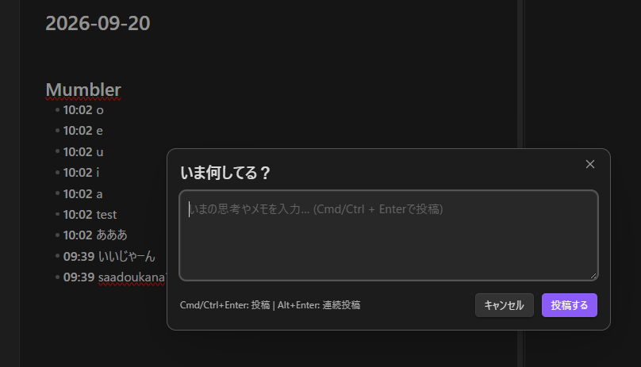

# Mumbler

[](https://github.com/u1e2k/mumbler/releases)
[](LICENSE)

An Obsidian plugin that lets you quickly jot down thoughts and micro-memos like a personal Twitter/X timeline, automatically appending them to today's daily note in reverse chronological order.

<p align="center">
  
</p>

---

[English](#features) | [日本語 (Japanese)](#日本語ガイド)

---

## Features

- ⚡ **Quick Input Popup**:
  - Open a sleek modal instantly via the ribbon icon (`message-square`) or command palette.
  - Submit instantly with `Cmd + Enter` (Mac) or `Ctrl + Enter` (Windows/Linux).
  - **Continuous Posting**: Press `Alt + Enter` (or `Option + Enter` on Mac) to submit without closing the modal so you can post multiple notes in a row.
  - Optimized for mobile/iPad: automatically delays focus slightly to reliably bring up the on-screen keyboard.
- 📅 **Automatic Daily Note Appending**:
  - Automatically appends notes to today's daily note (`Daily/YYYY-MM-DD.md`) with timestamps (`HH:mm`).
  - **Reverse Chronological Order**: New entries appear at the top of the section (timeline style).
  - **Multi-line Preserving**: Multi-line thoughts are neatly indented as child list items to preserve Markdown list syntax.
  - Automatically creates the `Daily` folder and note if they don't exist yet.
- ⚙️ **Customizable Heading**:
  - Customize the destination section heading (default: `## つぶやき` / `## Thoughts`) to fit your workflow.

---

## Usage

1. Click the **message-square** ribbon icon on the left sidebar, or trigger **"Mumbler: つぶやきを投稿"** from the Command Palette (`Ctrl/Cmd + P`).
2. Type your thought or memo into the text area.
3. Submit:
   - **`Cmd + Enter` / `Ctrl + Enter`** (or click **投稿する**): Post and close the popup.
   - **`Alt + Enter` / `Option + Enter`**: Post and keep the popup open for continuous entries.
4. Today's daily note is updated with your new entry inserted right under your chosen heading.

---

## Settings

Go to **Settings > Community Plugins > Mumbler** to customize:

| Setting | Description | Default |
| :--- | :--- | :--- |
| **追記先見出し名** (Heading Name) | The heading name in your daily note where memos will be appended. Treated as a level-2 heading (`## Heading`). | `つぶやき` |

> [!TIP]
> You can change this heading to anything you prefer, e.g. `Thoughts`, `Mumbles`, `Log`, `メモ`.

---

## Installation

### From Community Plugins (Once Approved)
1. Open **Settings > Community plugins** in Obsidian.
2. Search for **Mumbler**.
3. Click **Install**, then **Enable**.

### Via BRAT (Beta Reviewers Auto-update Tester)
1. Install the [BRAT plugin](https://github.com/TfTHacker/obsidian42-brat).
2. Go to Options > Add Beta plugin.
3. Enter `u1e2k/mumbler`.

### Manual Installation
1. Download `main.js` and `manifest.json` from the latest [GitHub Release](https://github.com/u1e2k/mumbler/releases).
2. Copy them into `<YourVault>/.obsidian/plugins/mumbler/`.
3. Reload Obsidian or toggle **Mumbler** in **Settings > Community plugins**.

---

## Development

### Direct Build Output to Local Vault (Optional)
Copy `env.example.json` to `env.json` and set your local vault path. The build script will automatically output `main.js` and copy `manifest.json` directly into your vault plugin directory.

```json
{
  "vaultPath": "C:/path/to/your/Obsidian Vault"
}
```
*(Note: `env.json` is git-ignored and will not be pushed to GitHub.)*

### Build Commands

```bash
# Install dependencies
npm install

# Watch mode (auto-rebuild on file change)
npm run dev

# Production build
npm run build

# Version bump & tag (e.g. 0.0.2 -> 0.0.3)
npm version patch
```

---

## 日本語ガイド

Obsidian内で「一人用Twitter」のように、思いついた瞬間に手軽にメモを書き込み、今日のデイリーノートの指定見出し配下に自動追記するプラグインです。

### 主な特徴
- **素早い入力**: 左リボンアイコンやコマンドパレットから起動し、`Cmd/Ctrl + Enter` でキーボードから手を離さずに即時投稿。
- **連続投稿対応**: `Alt + Enter`（Macでは `Option + Enter`）を押すことで、モーダルを閉じずにテキストエリアをクリアして次々と連続投稿可能。
- **逆時系列タイムライン**: 新しいつぶやきが上に来る形で挿入され、過去の思考をすばやく振り返ることができます。
- **安心のMarkdown維持**: 複数行にわたるつぶやきもスペース2つのインデントを自動付与し、Markdownのリスト構造を保持します。
- **見出しカスタマイズ**: 設定画面から追記先の見出し名（`## つぶやき`、`## メモ`、`## Thoughts` 等）を自由に変更可能。

### 設定画面
Obsidianの「設定」> プラグインオプション > 「Mumbler」から追記先見出し名を変更できます。

---

## License

This project is licensed under the [MIT License](LICENSE).